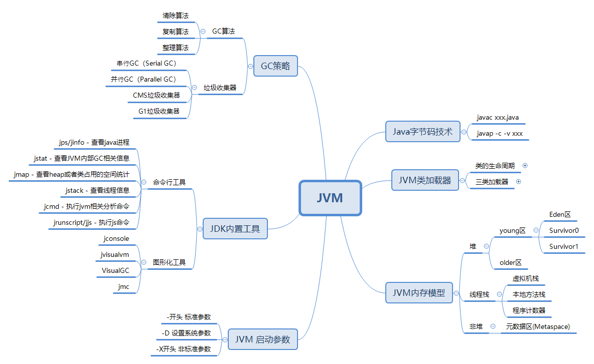
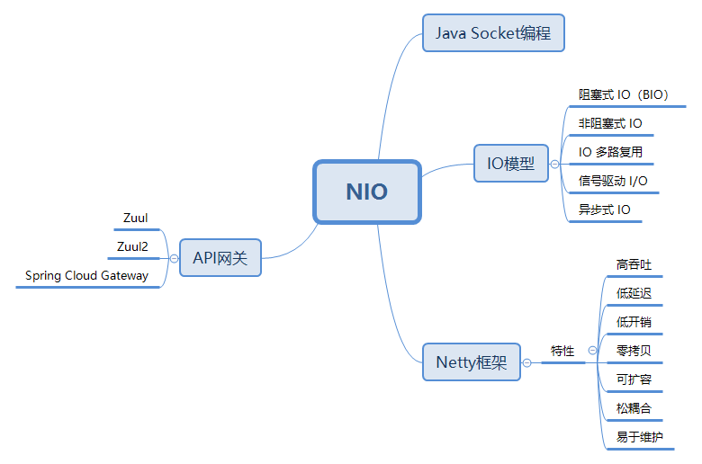
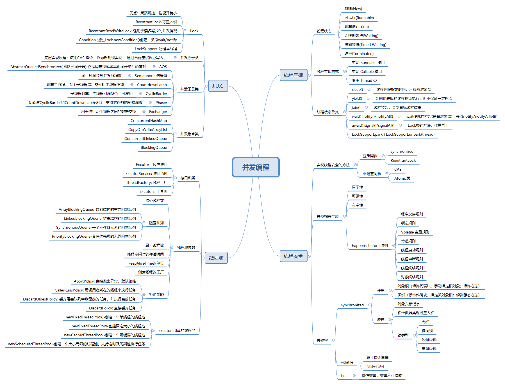
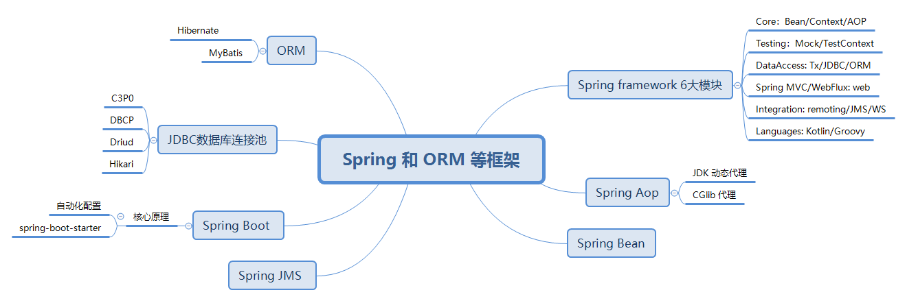
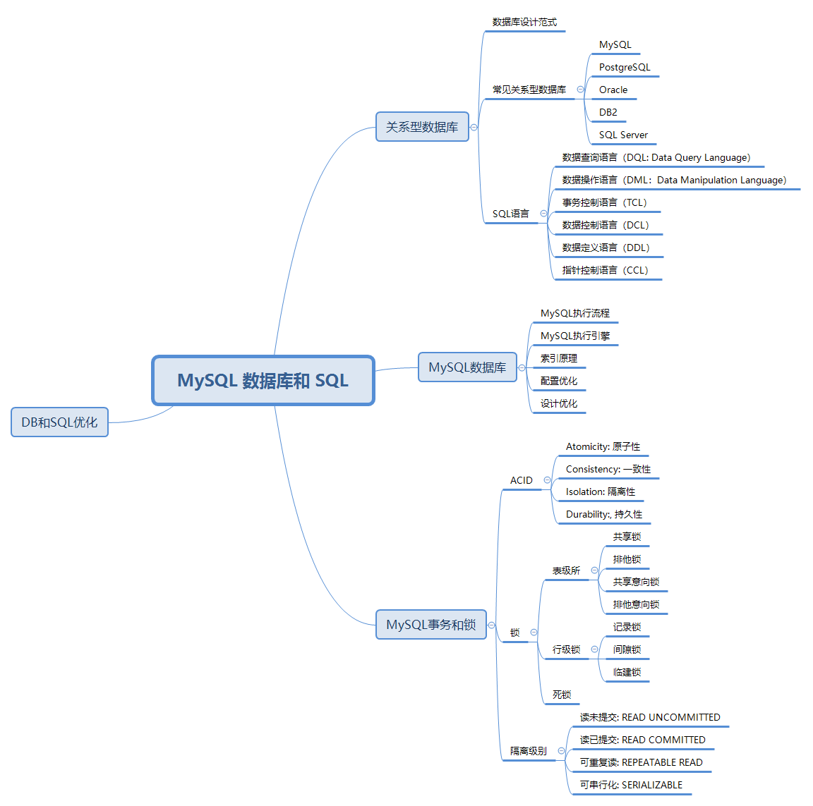
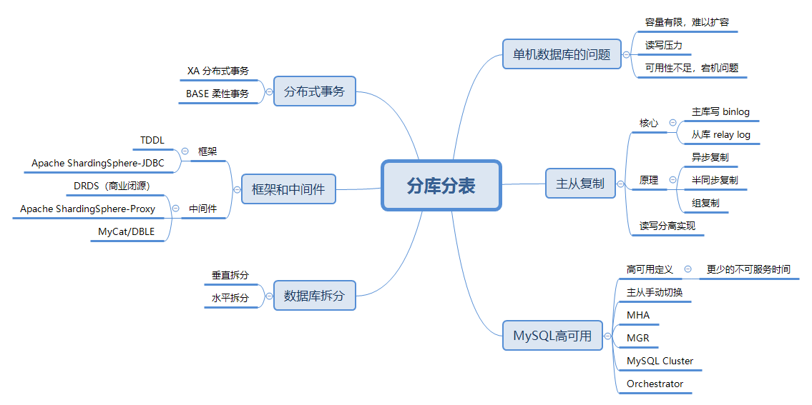
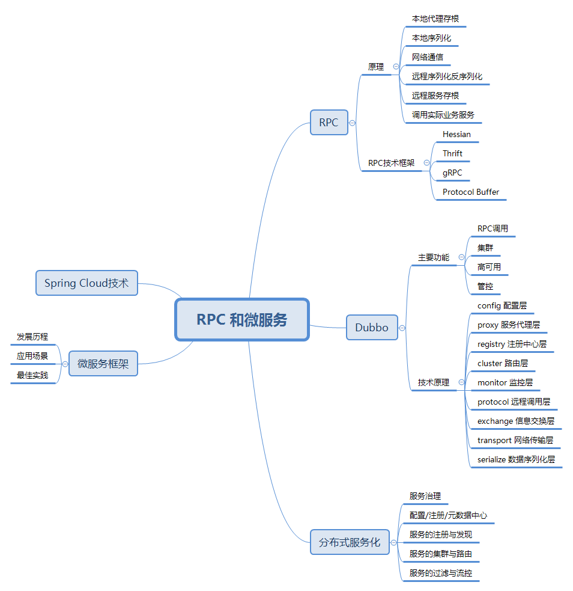
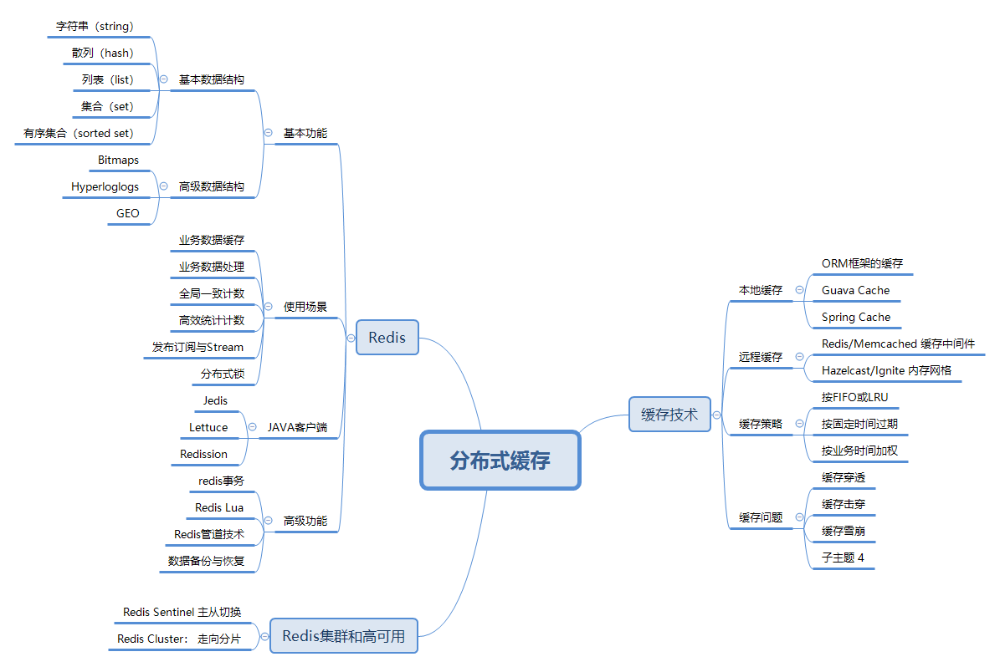
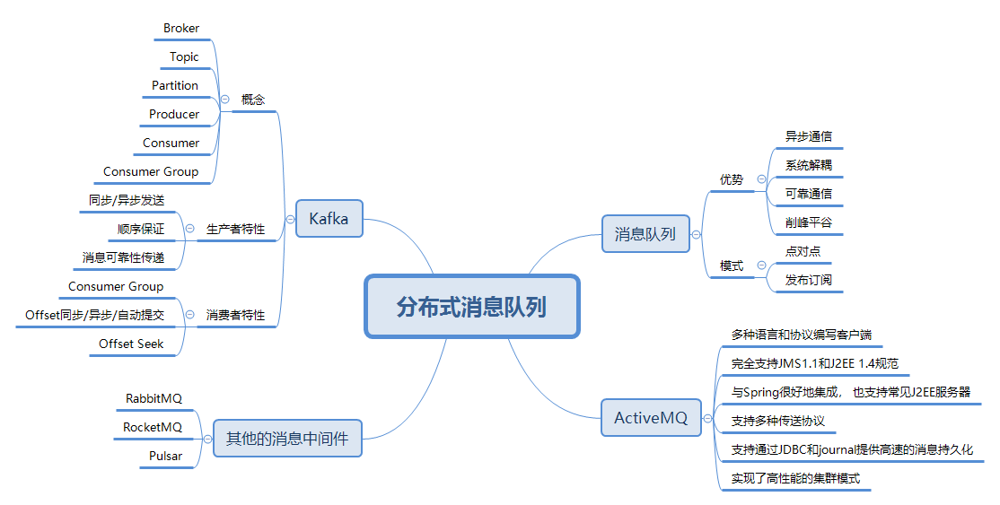

### 1)JVM

​	学习了JVM核心技术相关知识，通过秦老师的教导以及课上的实际操作，我对JVM的基础知识有了跟深入的理解。这个模块主要讲述了一下几个知识点：
​	1. Java字节码技术，分为栈操作、流程控制、对象操作、算术运算等四类指令
​	2. JVM类加载器，启动类加载器、扩展类加载器、应用类加载器
​	3. JVM内存模型，分为堆、线程栈、非堆三个区域，堆又分为年轻代、老年代，线程栈分为虚拟机栈、本地方法栈和程序计数器
​	4. GC策略，详细了解了串行GC、并行GC、CMS和G1垃圾收集器
​	5. JVM调优，通过不断地压测调整JVM启动参数

### 2)NIO

​	学习了SOCKET网络编程，IO模型以及Netty的原理，通过课上对Netty的实际操作以及手动实现API网关，对IO模型和Netty有了更深入的理解。NIO（Non-blocking I/O，也称为New I/O），是一种同步非阻塞的I/O模型，成为解决高并发与大量连接、I/O处理问题的有效方式。NIO主要有三大核心部分：Channel(通道)，Buffer(缓冲区), Selector。传统IO基于字节流和字符流进行操作，而NIO基于Channel和Buffer(缓冲区)进行操作，数据总是从通道读取到缓冲区中，或者从缓冲区写入到通道中。Selector(选择区)用于监听多个通道的事件。
​	

### 3) 并发编程

​	该模块学习了线程基础知识，包括线程的状态、实现以及启动、线程的异常处理等；线程池的原理及应用和线程池创建的经验；JUC并发包中Lock，Atomic原子类的实现原理以及使用实例；并发工具类的原理和使用示例，包括Semaphore、CountdownLatch、CyclicBarrier等

### 4)Spring 和 ORM 等框架

​	该模块讲述了Spring的框架的基础知识和原理（包括Spring框架的模块设计，Spring AOP面向切面编程的原理，Spring Bean的生命周期，Spring XML配置等）；然后学习了Spring Boot原理和应用，Spring Boot的核心包括自动化配置和spring-boot-starter整合第三方类库；最后学习了JDBC和数据库连接池，以及Spring集成ORM和JPA。

### 5)MySQL 数据库和 SQL

​	该模块学习了关系型数据库的概念（如数据库设计范式），常见的关系型数据库（MySQL，PostgreSQL，Oracle，DB2，SQL Server），MySQL数据库原理（MySQL存储，执行流程，索引原理）以及MySQL配置和设计优化；深入了解了MySQL的事务和锁的原理；SQL优化和常见常见分析。

### 6) 分库分表

​	该模块讲述了单机数据库面临的问题（容量有限、读写压力、可用性不足），采用主从复制来解决读写压力，主从复制核心是主库写binlog，从库relay log；基于主从复制，实现读写分离，提高系统数据处理能力；通过故障转移、灾难恢复等技术实现MySQL高可用；数据库的垂直/水平分库分表来解决数据技术膨胀的问题；最后学习了一下数据库框架（TDDL、Apache ShardingSphere-JDBC）和中间件（Apache ShardingSphere-Proxy、MyCat/DBLE、obar、Vitness）；XA分布式事务以及BASE 柔性事务实现一致性

### 7)RPC 和微服务

​	该模块学习了RPC基本原理（本地代理、序列化、网络通信、反序列化、服务存根、获取服务结果）以及RPC技术框架（Hessian, Thrift, gRPC），然后设计实现了一个RPC框架；分布式服务除了RPC框架，还需要考虑服务的治理，注册发现机制，负载均衡及路由，熔断限流等；Dubbo框架的原理和应用场景，Dubbo的主要功能为RPC调用，集群，高可用，管控等；分布式服务的治理以及配置/注册/元数据中心；微服务的发展和应用场景，Spring Cloud的技术体系。

### 8) 分布式缓存

​	该模块通过数据的使用频次和方式说明了缓存的必要性，然后引出了本地缓存（ORM框架的缓存，Guava Cache，Spring Cache）和远程缓存（Redis/Memcached 缓存中间件，Hazelcast/Ignite 内存网格）；缓存容量有限，可以通过可以使用FIFO/LRU等过期策略定期清理缓存；缓存遇到缓存穿透、缓存击穿、缓存雪崩的问题；Redis的基本原理、使用场景以及Redis的java客户端和Spring整合；最后学习了Redis集群和高可用。

### 9) 分布式消息队列

​	该模块从系统间的通信方式，引入消息队列的使用，MQ的主要优势为异步通信、系统解耦、削峰平谷、可靠通信，消息队列的处理模式（点对点，发布订阅模式），消息协议（AMQP、MQTT、STOMP等），然后学习了ActiveMQ的主要功能及使用示例；然后学习了Kafka的原理及使用，以及kafka的集群配置和高级特性；最后了解了其他的一些消息中间件（RabbitMQ、RocketMQ、Pulsar）。

